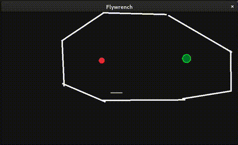

# Flywrench copy in C with raylib

One of my favourite games is https://www.flywrench.com/ This is a simple and incomplete clone done in C and with raylib.

All the levels (theres just 6) are made with tooling also included in the project. To switch to edit mode press 'P' and choose tools with 'D' to add walls (called segments), remove walls, place level goal, and 'S' to save to file

